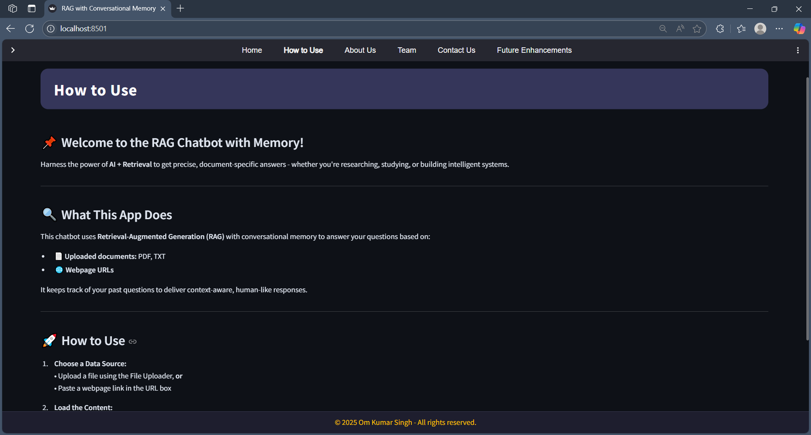
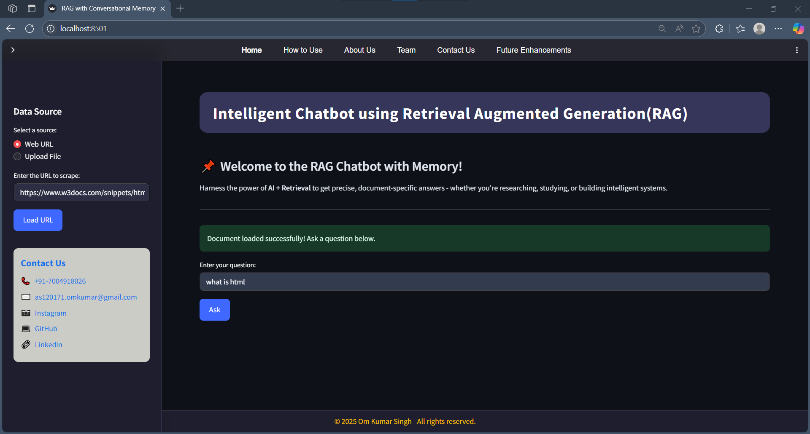
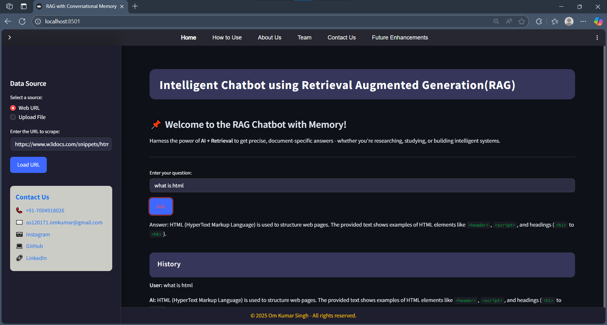

# 🤖 Intelligent-Chatbot-using-Retrieval-Augmented-Generation-RAG

Harness the power of **AI + Retrieval** to get precise, document-specific answers-whether you're researching, studying, or building intelligent systems.

 

---

## 📌 What is This?

The **RAG Chatbot** is an intelligent assistant that combines advanced language models with retrieval-augmented generation (RAG) and conversational memory. It can answer your questions based on:

- 📄 **Uploaded documents** (PDF, TXT)
- 🌐 **Webpage URLs**

It remembers your previous questions, so you get context-aware, human-like responses.

---

## 🚀 Features

- **Conversational Memory:** Remembers your chat history for context-rich answers.
- **Multi-source Retrieval:** Ask questions about uploaded files or scraped web pages.
- **Modern UI:** Built with Streamlit, featuring a sleek navbar, sidebar, and sticky footer.

---

## 🛠️ How to Use

1. **Clone the Repo & Install Requirements**
    ```
    git clone https://github.com/omsingh031/Intelligent-Chatbot-using-Retrieval-Augmented-Generation-RAG-.git
    cd your-repo-name
    pip install -r requirements.txt
    ```

2. **Set Up Environment Variables**  
   Create a `.env` file in the root directory with your API keys and config:
    ```
    LANGCHAIN_TRACING_V2=...
    LANGCHAIN_API_KEY=...
    LANGCHAIN_ENDPOINT=...
    LANGCHAIN_PROJECT=...
    ```

3. **Run the App**
    ```
    streamlit run app.py
    ```

4. **Interact!**
    - Upload a PDF or TXT file, or enter a webpage URL.
    - Click **Load File** or **Load URL**.
    - Ask your question in the chat input.
    - View your conversation history and explore other sections via the navigation bar.

---

## 🖥️ Screenshots

<!-- Add your own screenshots here -->




---

## 👥 About Us

Welcome to our RAG Chatbot-an intelligent assistant that bridges human curiosity and machine knowledge through cutting-edge AI.

We are a passionate team of developers, designers, and researchers dedicated to making information retrieval smarter, faster, and more contextual.  
Our mission: **To make AI more human-centric by combining advanced language models with intuitive user interfaces and real-world usability.**

---

## 💼 Team

- 👨‍💻 **Om Kumar Singh** – Lead Developer  
- 🧑‍💻 Ashi Jain  
- 🧑‍💻 Vansh Jain  
- 🧑‍💻 Roshmik Agrawal  
- 🧑‍💻 Aadish Chaturvedi  
- 🧑‍💻 Shambhavi Dubey

---

## 🌍 Why This Matters

In a world overflowing with unstructured information, our chatbot serves as a personal researcher, quickly digging through content and providing meaningful answers-with memory, clarity, and reliability.

---

## 🛣️ Future Enhancements

- Add support for more file types
- Improve long-term context handling
- Integrate authentication and user profiles
- Export chat logs and document references

---

## 📫 Contact

- 📞 **Phone:** +91-7004918026
- ✉️ **Email:** as120171.omkumar@gmail.com
- 📷 [Instagram](https://www.instagram.com/omsingh031/)
- 💻 [GitHub](https://github.com/omsingh031)
- 🔗 [LinkedIn](https://linkedin.com/in/omsingh031)

---

## 📝 License

This project is licensed under the MIT License. See [LICENSE](LICENSE) for details.

---

> _Made with ❤️ by Om Kumar Singh and Team_

# 🤖 Intelligent-Chatbot-using-Retrieval-Augmented-Generation-RAG
