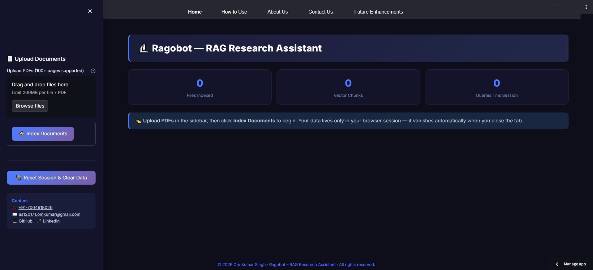
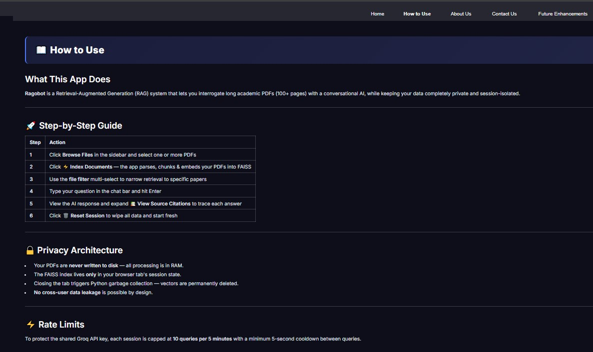
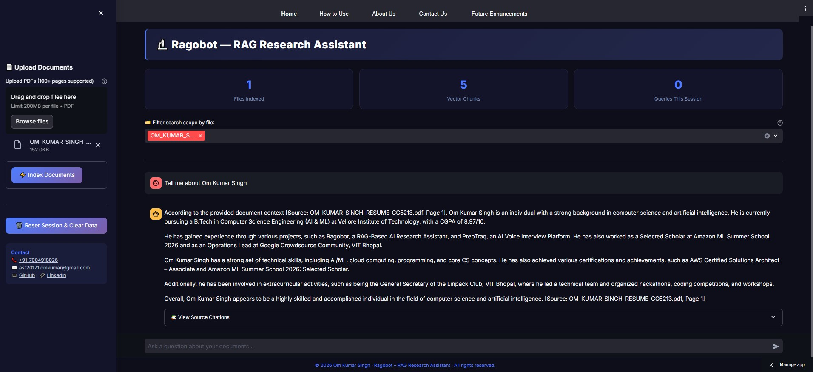
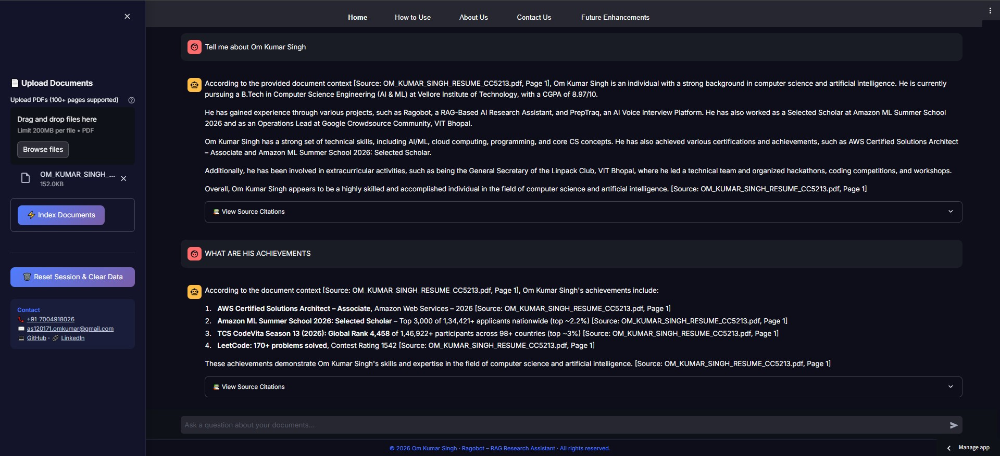

# 🤖 Ragobot — RAG Research Assistant

Harness the power of **AI + Retrieval** to get precise, document-specific answers — whether you're researching, studying, or building intelligent systems.

 

---

## 📌 What is This?

**Ragobot** is a Retrieval-Augmented Generation (RAG) system that lets you interrogate long academic PDFs (100+ pages) with a conversational AI, while keeping your data completely private and session-isolated. It remembers your previous questions to deliver context-aware, human-like responses.

---

## 🚀 Features

- **Conversational Memory:** Remembers your chat history for context-rich answers.
- **Advanced Retrieval:** Uses FAISS and Nomic open-source embeddings for lightning-fast semantic search.
- **Blazing Fast AI:** Powered by Groq (`llama-3.3-70b-versatile`) for near-instantaneous text generation.
- **Source Citations:** Every AI answer includes expandable citations linking back to the exact source file and page number.
- **Absolute Privacy:** Your PDFs are never written to disk — all processing is done entirely in RAM and vanishes automatically when you close the tab.
- **Modern UI:** Built with Streamlit, featuring a sleek custom navigation bar, sticky footer, and responsive metric cards.

---

## 🛠️ Technical Architecture

| Component | Technology |
|-----------|-----------|
| **LLM** | Groq `llama-3.3-70b-versatile` |
| **Embeddings** | `nomic-ai/nomic-embed-text-v1.5` (8K context) |
| **Vector Store** | FAISS (in-memory, CPU) |
| **Chunking** | LangChain `RecursiveCharacterTextSplitter` |
| **PDF Parsing** | PyMuPDF (in-RAM, no disk I/O) |
| **UI** | Streamlit + Custom CSS |

---

## 💻 How to Use Locally

1. **Clone the Repo & Install Requirements**
    ```bash
    git clone https://github.com/omsingh031/Intelligent-Chatbot-using-Retrieval-Augmented-Generation-RAG-.git
    cd Intelligent-Chatbot-using-Retrieval-Augmented-Generation-RAG-
    pip install -r requirements.txt
    ```

2. **Set Up Environment Variables**  
   Create a `.env` file in the root directory and add your Groq API key:
    ```env
    GROQ_API_KEY="gsk_your_groq_api_key_here"
    ```
   *(You can get a free API key at [console.groq.com](https://console.groq.com))*

3. **Run the App**
    ```bash
    streamlit run app.py
    ```

4. **Interact!**
    - Click **Browse Files** in the sidebar and select one or more PDFs.
    - Click **⚡ Index Documents**.
    - Use the file filter to narrow your search scope if desired.
    - Ask a question in the chat bar and view the AI response with citations!

---

## 🖥️ Screenshots

<!-- Add your own screenshots here -->




---

## 👥 About Us

Welcome to our RAG Chatbot — an intelligent assistant that bridges human curiosity and machine knowledge through cutting-edge AI.

We are a passionate team of developers, designers, and researchers dedicated to making information retrieval smarter, faster, and more contextual.  
Our mission: **To make AI more human-centric by combining advanced language models with intuitive user interfaces and real-world usability.**

---

## 🛣️ Future Enhancements

- **Web URL Ingestion:** Scrape and index web articles alongside PDFs
- **Multi-modal Support:** Parse tables, charts, and images from PDFs
- **Authentication:** User accounts with persistent named sessions
- **Export Chat Logs:** Download full conversation + citations as PDF/Markdown
- **Hybrid Search:** Combine FAISS dense search with BM25 sparse search for higher recall

---

## 📫 Contact

- 📞 **Phone:** +91-7004918026
- ✉️ **Email:** as120171.omkumar@gmail.com
- 📷 [Instagram](https://www.instagram.com/omsingh031/)
- 💻 [GitHub](https://github.com/omsingh031)
- 🔗 [LinkedIn](https://linkedin.com/in/omsingh031)

---

## 📝 License

This project is licensed under the MIT License. See [LICENSE](LICENSE) for details.

---

> _Made with ❤️ by Om Kumar Singh_
